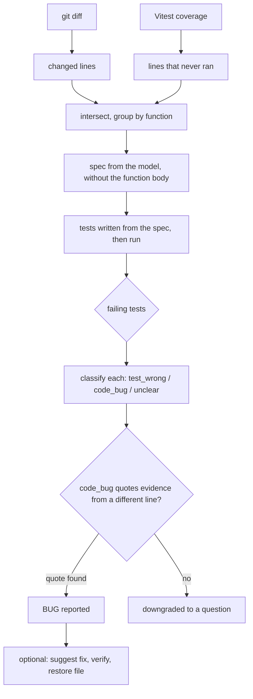

# testgap

Finds code changed in a pull request that has no tests, writes tests for it with an LLM, runs them, and reports suspected bugs with a verified fix.

## Why

High coverage can hide bugs in untested branches. Generated tests that are written by reading the code tend to copy its bugs instead of catching them.

## How it works



1. `git diff` gives the changed lines (`diff.py`).
2. Vitest coverage gives the lines that never ran (`adapters/vitest.py`).
3. The two are intersected and grouped by function; anonymous callbacks roll up to their named parent (`gaps.py`).
4. Spec: the model describes the intended behavior of the function without seeing its body.
5. Tests are written from the spec and run.
6. Each failing test is classified separately as `test_wrong`, `code_bug` or `unclear`.
7. A `code_bug` must quote evidence from a different line of the file (a doc comment, other code, a caller). The tool checks that the quote exists; otherwise the report is downgraded to a question.
8. Optional (`--suggest-fixes`): a fix is suggested, applied to the file temporarily, verified against the generated tests and the existing suite, and the file is always restored.

## Design decisions

- **Spec without the implementation.** A model that reads the code writes tests that agree with it, bugs included.
- **Per-test classification.** Failures with different causes (bad test vs. real bug) should not share one verdict.
- **Evidence is verified in code.** The model's claim that something is a bug is not trusted; the quoted line must exist in the file and must not be the faulty line itself.
- **`it.skip` instead of deleting tests.** A suspected-bug test is skipped with a comment, and a human decides what it means.
- **Fixes are suggested and verified, never applied.** The file is restored after verification.
- **The tool's own logic is unit-tested with the LLM mocked.**

## Results on the demo repo

Demo repo: [github.com/shirel-shushan/testgap-demo](https://github.com/shirel-shushan/testgap-demo). It has 13 untested functions and 3 planted bugs. The answer key is kept out of the repo so the tool cannot read it.

| Version | Functions | Planted bugs found | False BUG reports | Questions |
|---|---|---|---|---|
| Before evidence check | 13 | 2 of 3 | 12 | 0 |
| With evidence check | 7 (the 3 buggy + 4 that had false reports) | 2 of 3 | 1 | 3 |

One extra bug, written by hand (an off-by-one loop in `average`), was found, and a fix was suggested and verified.

Results vary between runs. The minimum-subtotal bug was found in some runs and missed in others.

## What went wrong along the way

| Problem | Fix |
|---|---|
| Anonymous callbacks showed up as separate gaps | Roll them up to their named parent function |
| No boundary tests were generated | Spec and test prompts ask for the exact boundary value and one value on each side |
| The model "fixed" correct tests to match the bug | Wrong tests are fixed by name, suspected bugs become `it.skip`, and the model is told not to change any other test |
| The model copied the bug from the code | Spec is written without the function body |
| Mixed failures were classified together | Classify each failing test separately |
| Truncated model output | Detect `max_tokens` and ask the model for a shorter file instead of parsing partial output |
| JSON buried in reasoning text | Extract the last valid JSON object, preferring one with a `verdict` key |
| The model quoted the faulty line as its own evidence | Evidence must come from a different line, and the quote is checked against the file |

## Limitations

- JavaScript with Vitest only. The repo needs an existing test setup.
- Results are inconsistent between runs.
- When many tests fail for the same bug, the run can end as `gave_up` (the bug is still reported).
- The spec can invent business rules. This is mitigated, not solved.
- `--report` is accepted but not implemented yet.

## Usage

Install:

```sh
python -m venv .venv
.venv\Scripts\activate        # Windows; on Linux/macOS: source .venv/bin/activate
pip install -e ".[dev]"
export TESTGAP_API_KEY=...    # PowerShell: $env:TESTGAP_API_KEY = "..."
```

Run:

```sh
testgap run --repo PATH [options]
```

| Flag | Meaning |
|---|---|
| `--repo PATH` | Path to the JavaScript repo (required) |
| `--base BRANCH` | Branch to diff against (default `main`) |
| `--all` | Ignore the diff and treat every uncovered line as changed |
| `--generate` | Generate tests for the gaps (needs `TESTGAP_API_KEY`) |
| `--max-gaps N` | Maximum number of gaps to generate for (default 3) |
| `--only NAME[,NAME...]` | Only process gaps whose function name is in the list |
| `--verbose` | With `--generate`, save specs, tests and outputs to `<repo>/.testgap/runs` and print per-attempt details |
| `--suggest-fixes` | With `--generate`, suggest a fix for each bug and verify it by running the tests |
| `--report FILE` | Not implemented yet |

Without `--generate`, the tool only lists the gaps.

Example:

```sh
testgap run --repo ../testgap-demo --all --generate --suggest-fixes --only average
```

**Model.** The default is `claude-haiku-4-5-20251001`. Set `TESTGAP_MODEL` to use another one.

**Cost.** A run on one function costs a few cents with the default model.

## Running the tests

```sh
pytest
```

All LLM calls are mocked.
